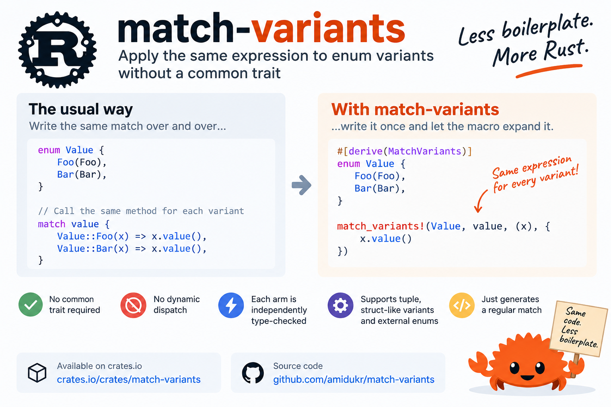

# match-variants



`match-variants` provides procedural macros for applying the same expression to every variant of a Rust enum without requiring the variants or their payload types to implement a common trait.

Each generated `match` arm is type-checked independently against its concrete variant. This makes it useful when several unrelated types expose compatible operations but introducing a shared trait would be unnecessary, undesirable, or impossible for the trait shape you need.

The crate can also associate a Rust type with each enum variant and expose it as a local type alias inside the generated match arm.

## Example

```rust
use match_variants::{match_variants, MatchVariants};

struct Foo(f64);
struct Bar(f64);

impl Foo {
    fn value(self) -> f64 {
        self.0
    }
}

impl Bar {
    fn value(self) -> f64 {
        self.0 * 2.0
    }
}

#[derive(MatchVariants)]
enum Value {
    Foo(Foo),
    Bar(Bar),
}

fn value(value: Value) -> f64 {
    match_variants!(Value, value, (x), {
        x.value()
    })
}

assert_eq!(value(Value::Foo(Foo(10.0))), 10.0);
assert_eq!(value(Value::Bar(Bar(10.0))), 20.0);
```

Conceptually, the `match_variants!` invocation above produces a match equivalent to:

```rust
match value {
    Value::Foo(x) => x.value(),
    Value::Bar(x) => x.value(),
}
```

There is no trait-object dispatch, runtime type inspection, or allocation introduced by `match-variants`. The macro generates ordinary Rust `match` code.

## Supported enums

`#[derive(MatchVariants)]` supports enums whose variants all use the same shape.

Tuple variants:

```rust
#[derive(MatchVariants)]
enum Value {
    Foo(Foo),
    Bar(Bar),
}
```

Struct-like variants:

```rust
#[derive(MatchVariants)]
enum Value {
    Foo { value: Foo },
    Bar { value: Bar },
}
```

Unit variants:

```rust
#[derive(MatchVariants)]
enum Value {
    Foo,
    Bar,
}
```

Tuple, struct-like, and unit variants cannot currently be mixed in the same enum.

## Tuple variants

Bindings are specified with tuple-pattern syntax:

```rust
let result = match_variants!(Value, value, (x), {
    x.value()
});
```

Multiple fields can be bound:

```rust
let result = match_variants!(Value, value, (x, context), {
    x.process(context)
});
```

The same binding pattern is applied to every variant.

## Struct-like variants

For named fields, specify the field name and the binding pattern:

```rust
let result = match_variants!(Value, value, { value: x }, {
    x.value()
});
```

Multiple fields can be bound:

```rust
let result = match_variants!(
    Value,
    value,
    {
        value: x,
        context: context,
    },
    {
        x.process(context)
    }
);
```

Fields not listed in the macro invocation are ignored.

## Unit variants

Unit variants do not require a payload pattern:

```rust
#[derive(MatchVariants)]
enum Value {
    Foo,
    Bar,
}

let result = match_variants!(Value, value, {
    do_something()
});
```

This is particularly useful together with variant-associated types.

## Variant-associated types

A Rust type can optionally be associated with each enum variant using `#[variant_type(...)]`.

For example:

```rust
struct Foo;
struct Bar;

#[derive(MatchVariants)]
enum Value {
    #[variant_type(Foo)]
    Foo,

    #[variant_type(Bar)]
    Bar,
}
```

The associated type can then be introduced inside every generated match arm using a local type alias:

```rust
let result = match_variants!(Value, value, type T, {
    process::<T>()
});
```

Conceptually, this generates:

```rust
match value {
    Value::Foo => {
        type T = Foo;
        process::<T>()
    }
    Value::Bar => {
        type T = Bar;
        process::<T>()
    }
}
```

`T` therefore refers to a different concrete type in each match arm, while the body of the operation is written only once.

The type name after `type` is chosen by the caller. For example:

```rust
match_variants!(Value, value, type Item, {
    process::<Item>()
});
```

The `#[variant_type(...)]` attribute accepts Rust types, including paths and generic types:

```rust
#[derive(MatchVariants)]
enum Value {
    #[variant_type(crate::foo::Foo)]
    Foo,

    #[variant_type(Container<f64>)]
    Bar,
}
```

If `#[variant_type(...)]` is used, it must be specified for every variant. An enum may therefore have either:

- no `#[variant_type(...)]` attributes, or
- a `#[variant_type(...)]` attribute on every variant.

Partial variant type metadata is rejected at compile time.

Requesting a `type` binding for an enum without variant type metadata is also rejected at compile time.

## Combining variant types with payloads

Variant-associated types are independent of variant payloads.

For tuple variants:

```rust
struct Foo;
struct Bar;

#[derive(MatchVariants)]
enum Value {
    #[variant_type(Foo)]
    Foo(f64),

    #[variant_type(Bar)]
    Bar(f64),
}

fn process<T>(value: f64) -> (&'static str, f64) {
    (std::any::type_name::<T>(), value)
}

let result = match_variants!(
    Value,
    value,
    type T,
    (x),
    {
        process::<T>(x)
    }
);
```

This is conceptually equivalent to:

```rust
match value {
    Value::Foo(x) => {
        type T = Foo;
        process::<T>(x)
    }
    Value::Bar(x) => {
        type T = Bar;
        process::<T>(x)
    }
}
```

The same mechanism works with struct-like variants:

```rust
#[derive(MatchVariants)]
enum Value {
    #[variant_type(Foo)]
    Foo { value: f64 },

    #[variant_type(Bar)]
    Bar { value: f64 },
}

let result = match_variants!(
    Value,
    value,
    type T,
    { value: x },
    {
        process::<T>(x)
    }
);
```

The associated type does not have to be the type of the payload. It is metadata attached to the variant and can represent whatever type is appropriate for the operation.

Variant type metadata also does not affect ordinary `match_variants!` calls. An enum with complete `#[variant_type(...)]` metadata can still be matched without requesting a type binding:

```rust
let result = match_variants!(Value, value, { value: x }, {
    use_value(x)
});
```

## Using enums from another module

`MatchVariants` generates a helper macro for each derived enum. When `match_variants!` is called from a different module, that helper macro must be brought into the calling module's macro scope.

Use `import_match_variants!` for this.

For example:

```rust
use match_variants::{
    import_match_variants,
    match_variants,
    MatchVariants,
};

pub mod domain {
    use super::MatchVariants;

    pub struct Foo(pub f64);
    pub struct Bar(pub f64);

    impl Foo {
        pub fn value(self) -> f64 {
            self.0
        }
    }

    impl Bar {
        pub fn value(self) -> f64 {
            self.0 * 2.0
        }
    }

    #[derive(MatchVariants)]
    pub enum TupleValue {
        Foo(Foo),
        Bar(Bar),
    }

    #[derive(MatchVariants)]
    pub enum NamedValue {
        Foo { value: Foo },
        Bar { value: Bar },
    }
}

mod consumer {
    use super::domain;
    use super::match_variants;
    use match_variants::import_match_variants;

    import_match_variants!(
        crate::domain::{
            NamedValue,
            TupleValue,
        }
    );

    pub fn tuple_value(value: domain::TupleValue) -> f64 {
        match_variants!(
            crate::domain::TupleValue,
            value,
            (x),
            {
                x.value()
            }
        )
    }

    pub fn named_value(value: domain::NamedValue) -> f64 {
        match_variants!(
            crate::domain::NamedValue,
            value,
            { value: x },
            {
                x.value()
            }
        )
    }
}
```

`import_match_variants!` expands to imports of the helper macros generated by `#[derive(MatchVariants)]`.

Conceptually:

```rust
import_match_variants!(
    crate::domain::{
        NamedValue,
        TupleValue,
    }
);
```

imports the helpers corresponding to `NamedValue` and `TupleValue` from `crate::domain`.

This is normally preferable to referring to the generated helper macros directly.

## Using enums from an external crate

The same mechanism works across crate boundaries.

Suppose a library crate named `my_domain` defines:

```rust
use match_variants::MatchVariants;

pub struct Foo(pub f64);
pub struct Bar(pub f64);

impl Foo {
    pub fn value(self) -> f64 {
        self.0
    }
}

impl Bar {
    pub fn value(self) -> f64 {
        self.0 * 2.0
    }
}

#[derive(MatchVariants)]
pub enum Value {
    Foo(Foo),
    Bar(Bar),
}
```

A dependent crate can use the enum with:

```rust
use match_variants::{
    import_match_variants,
    match_variants,
};

use my_domain::Value;

import_match_variants!(
    my_domain::{
        Value,
    }
);

fn value(value: Value) -> f64 {
    match_variants!(Value, value, (x), {
        x.value()
    })
}
```

The enum type and its generated helper macro are separate things:

- `use my_domain::Value;` imports the enum type.
- `import_match_variants!(my_domain::{ Value });` imports the helper macro used by `match_variants!`.

If the enum lives inside a public module of the external crate, use that module path:

```rust
use my_domain::domain::Value;

import_match_variants!(
    my_domain::domain::{
        Value,
    }
);
```

Then:

```rust
fn value(value: Value) -> f64 {
    match_variants!(Value, value, (x), {
        x.value()
    })
}
```

You can also keep the enum path qualified:

```rust
fn value(value: my_domain::domain::Value) -> f64 {
    match_variants!(
        my_domain::domain::Value,
        value,
        (x),
        {
            x.value()
        }
    )
}
```

The module containing the derived enum must be publicly accessible if the generated helper is to be imported from another crate.

## Importing multiple enums

Multiple helper macros from the same module can be imported together:

```rust
import_match_variants!(
    my_domain::domain::{
        FooValue,
        BarValue,
        BazValue,
    }
);
```

This corresponds to importing the generated helper for each listed enum.

## Why not a common trait?

A traditional solution is to define a trait implemented by every payload type and dispatch through that trait.

That is often the right design when the types genuinely share an abstraction. `match-variants` targets a different case: the types are unrelated, but a particular piece of code happens to be valid for every variant.

For example:

```rust
match_variants!(Value, value, (x), {
    x.value()
})
```

is expanded into separate match arms. If `Value::Foo` contains `Foo` and `Value::Bar` contains `Bar`, then `x.value()` is independently type-checked once with `x: Foo` and once with `x: Bar`.

The types do not need to implement a shared trait.

Variant-associated types cover another case where the operation itself may be generic over a type associated with the variant:

```rust
match_variants!(Value, value, type T, {
    process::<T>()
})
```

Again, each generated arm uses a concrete type. No runtime type dispatch is introduced.

## Why not a common trait or `enum_dispatch`?

A traditional solution is to define a trait implemented by every payload type and dispatch through that trait.

Crates such as [`enum_dispatch`](https://crates.io/crates/enum_dispatch) can remove much of the boilerplate involved in forwarding trait calls through an enum. When its model fits the problem, `enum_dispatch` is often a good solution.

In fact, `enum_dispatch` was where the idea for `match-variants` started. However, there are situations it cannot handle — for example, when the trait involves associated types (`type T = ...`), associated functions without `self`, or methods involving `Self` where the concrete implementation type matters. It also doesn't cover cases where there is no useful trait abstraction in the first place, such as an enum of unit variants representing different associated types.

`match-variants` takes a different approach. Instead of generating trait delegation, it generates an ordinary `match` and repeats the supplied expression for every variant.

For example:

```rust id="3pf84r"
match_variants!(Value, value, (x), {
    x.value()
})
```

is expanded into separate match arms. If `Value::Foo` contains `Foo` and `Value::Bar` contains `Bar`, then `x.value()` is independently type-checked once with `x: Foo` and once with `x: Bar`.

The types do not need to implement a shared trait.

This also makes struct-like variants with named fields straightforward:

```rust id="7o8p3z"
match_variants!(Value, value, { value: x }, {
    x.value()
})
```

Variant-associated types cover another case where the operation itself may be generic over a type associated with the variant:

```rust id="0j5dxl"
match_variants!(Value, value, type T, {
    process::<T>()
})
```

Again, each generated arm uses a concrete type. No runtime type dispatch is introduced.

The goal is therefore not to replace `enum_dispatch`, but to cover cases where trait-based enum delegation is either unsupported or simply not the abstraction you want.

## Public API

The crate exposes three macros:

- `#[derive(MatchVariants)]` — generates variant information and the helper macro for an enum.
- `match_variants!` — generates a match that applies the supplied expression to every variant.
- `import_match_variants!` — imports generated helper macros when they are needed from another module or crate.

`#[derive(MatchVariants)]` also recognizes the optional `#[variant_type(...)]` helper attribute for associating a type with each enum variant.

## License

Licensed under the Apache License, Version 2.0.
